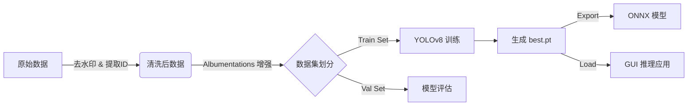

<div align="center">

# Luyun-Artifact-Vision (鲁韵文物智眸)

### 基于 YOLOv8 的文物图像细粒度分类与识别系统
**[ YOLOv8 | PyTorch | Albumentations | Tkinter ]**

<p>
  
  
  
</p>

专为文化遗产保护设计的智能识别系统，支持文物图像的高精度分类、数据增强与本地可视化推理。

[数据清洗] · [自动增强] · [模型训练] · [GUI识别]

---
</div>

## ✨ 功能亮点

| 特性 | 描述 |
|------|------|
| 🧹 **智能清洗** | 自动提取文物 ShortID，集成去水印算法 (Inpainting) 净化原始数据 |
| 🔄 **数据增强** | 基于 Albumentations 的 20x 数据扩充（旋转、噪点、透视变换），解决小样本问题 |
| 🎯 **高精识别** | 采用 YOLOv8-Cls 模型，Top-1 准确率高达 **99.8%**，Top-5 准确率 100% |
| 🖥️ **可视化交互** | 提供 Tkinter 桌面级 GUI，支持中文名称显示，Top-5 实时预测 |
| 📦 **部署友好** | 支持一键导出 ONNX 通用格式，便于 Spring Boot 或移动端集成 |

---

## 🏗️ 技术栈

### 🧠 核心算法
- **Ultralytics YOLOv8**: 最先进的图像分类模型
- **PyTorch**: 深度学习计算框架
- **Albumentations**: 极速图像增强库

### 🛠️ 数据处理
- **OpenCV**: 图像读取、写入与去水印处理
- **Pandas/Numpy**: 数据分析与矩阵运算

### 🖥️ 应用开发
- **Tkinter**: Python 标准 GUI 库
- **Conda**: 环境与依赖管理

---

## 📁 目录结构

```
Luyun-Artifact-Vision/
├── app/                        # 桌面应用程序
│   └── inference_gui.py        # 推理 GUI 入口
├── datasets/                   # 数据集仓库
│   ├── raw/                    # 原始文物图像
│   └── processed/              # 增强后的训练数据
├── docs/                       # 项目文档
│   └── Development_Plan.md     # 开发计划书
├── models/                     # 模型文件
│   └── artifact_cls_best.onnx  # 导出模型
├── runs/                       # 训练日志与权重
├── scripts/                    # 核心脚本
│   ├── data_augment.py         # 数据增强与预处理
│   ├── train_yolo.py           # 模型训练脚本
│   └── test_inference.py       # 命令行推理测试
├── environment.yml             # Conda 环境配置
├── main.py                     # (可选) 主入口
└── README.md                   # 项目说明文档
```

---

## 🚀 快速开始

### 1️⃣ 环境安装
确保已安装 [Anaconda](https://www.anaconda.com/)，然后执行：
```bash
# 创建环境
conda env create -f environment.yml

# 激活环境
conda activate luyun-cv
```

### 2️⃣ 数据准备
将收集到的文物图片放入 `datasets/raw/` 目录，结构如下：
```
datasets/raw/
  ├── Category1/
  │     ├── Era_Name_ShortID1/
  │     └── Era_Name_ShortID2/
  └── ...
```

### 3️⃣ 运行数据增强
```bash
# 自动清洗水印并生成增强数据
python scripts/data_augment.py
```

### 4️⃣ 开始训练
```bash
# 自动检测 GPU 并开始训练
python scripts/train_yolo.py
```

### 5️⃣ 启动识别应用
```bash
# 打开图形化界面进行测试
python app/inference_gui.py
```

---

## ⚙️ 核心配置

主要配置位于 `scripts/train_yolo.py` 和 `scripts/data_augment.py`：

| 配置项 | 文件 | 默认值 | 说明 |
|--------|------|--------|------|
| `TARGET_COUNT` | `data_augment.py` | 50 | 每个文物的目标增强数量 |
| `VAL_RATIO` | `data_augment.py` | 0.2 | 验证集比例 (20%) |
| `EPOCHS` | `train_yolo.py` | 50/100 | 训练轮次 |
| `BATCH_SIZE` | `train_yolo.py` | 16 | 批处理大小 |
| `MODEL_NAME` | `train_yolo.py` | yolov8n-cls.pt | 预训练模型基座 |

---

## 🧭 核心流程



---

## 🔧 故障排查

| 问题 | 解决方案 |
|------|----------|
| `CUDA not available` | 检查 PyTorch 是否安装了 CUDA 版本: `conda list pytorch` |
| `OpenCV read error` | 确保路径中不包含特殊字符，或使用脚本中提供的 `cv2_imread` 修复方法 |
| `Memory Error` | 在 `train_yolo.py` 中调小 `BATCH_SIZE` (如改为 8 或 4) |

---

## 📝 许可证

MIT License — 仅供学习交流，请遵守相关法律法规。

## 👨‍💻 作者

- **开发者**: IceYuanyyy
- **邮箱**: 2478686497@qq.com / ercurym86@gmail.com
- **GitHub**: [@IceYuanyyy](https://github.com/IceYuanyyy)

## ⭐ Star History

如果这个项目对你有帮助，请给一个 Star ⭐️

## 📮 联系方式

如有问题或建议，欢迎通过以下方式联系：

- 📧 Email: 2478686497@qq.com / ercurym86@gmail.com
- 💬 GitHub Issues: [提交Issue](https://github.com/IceYuanyyy/Luyun-Artifact-Vision/issues)

---

<div align="center">

**[⬆ 返回顶部](#)**

Made with ❤️ by IceYuanyyy

</div>
